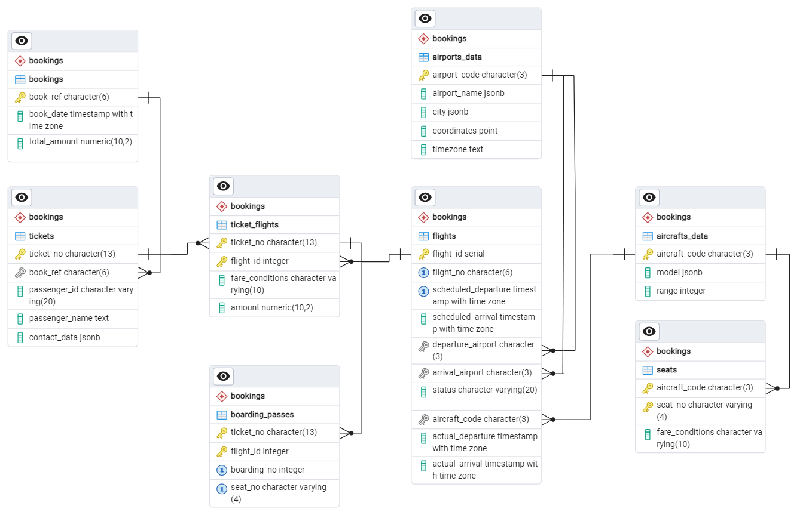

# Exploring Russian Airlines Data: SQL Case Studies

This document provides documentation for each SQL query written for analysis in the Russian Airlines database.

## Database Overview

The data used for these SQL case studies comes from the Russian Airlines demo database, which is specifically designed to showcase various PostgreSQL functionalities for developers. The database contains tables related to airlines, flights, airports, tickets, and more, offering a comprehensive view of airline operations.

You can explore and download the database from the official source here: [Russian Airlines Demo Database](https://postgrespro.com/community/demodb).

### Entity-Relationship Diagram (ERD)



## CASE 1: Flight Delay Analysis
**Goal**: Identify the airports with the lowest average delay for flights.

### Query:
```sql
WITH DELAYS AS (
    SELECT F.DEPARTURE_AIRPORT,
           AD.AIRPORT_NAME ->> 'en' AS AIRPORT_NAME_IN_ENGLISH,
           AVG(F.ACTUAL_DEPARTURE - F.SCHEDULED_DEPARTURE) AS AVG_DELAY_TIME
    FROM AIRPORTS_DATA AD
    JOIN FLIGHTS F ON AD.AIRPORT_CODE = F.DEPARTURE_AIRPORT
    GROUP BY F.DEPARTURE_AIRPORT, AD.AIRPORT_NAME
)
SELECT *
FROM DELAYS
ORDER BY AVG_DELAY_TIME;
```

### Result:

| DEPARTURE_AIRPORT | AIRPORT_NAME_IN_ENGLISH   | AVG_DELAY_TIME     |
| ----------------- | --------------------------| -------------------|
| OSW               | Orsk Airport              | 00:07:29.282297    |
| IWA               | Ivanovo South Airport     | 00:09:45.714286    |
| UUA               | Bugulma Airport           | 00:09:54.316940    |
| LPK               | Lipetsk Airport           | 00:10:25.877863    |
| SLY               | Salekhard Airport         | 00:10:29.016393    |

## CASE 2: Flight Counts by Airport
**Goal**: Calculate the count of flights at each airport for each day of the week within a year.

```sql
WITH UNION_FLIGHTS AS
	(SELECT FLIGHT_ID,
			DEPARTURE_AIRPORT AS AIRPORT_CODE,
			ACTUAL_DEPARTURE AS DATE_OF_FLIGHT_IN_AIRPORT
		FROM FLIGHTS
		WHERE ACTUAL_DEPARTURE IS NOT NULL
		UNION SELECT FLIGHT_ID,
			ARRIVAL_AIRPORT AS AIRPORT_CODE,
			ACTUAL_ARRIVAL AS DATE_OF_FLIGHT_IN_AIRPORT
		FROM FLIGHTS
		WHERE ACTUAL_ARRIVAL IS NOT NULL )
SELECT AD.AIRPORT_NAME - >> 'en' AS AIRPORT_NAME,
	TO_CHAR(UF.DATE_OF_FLIGHT_IN_AIRPORT,'Day') AS DAY_NAME,
	COUNT(*) AS COUNT_FLIGHTS
FROM UNION_FLIGHTS UF
JOIN AIRPORTS_DATA AD ON UF.AIRPORT_CODE = AD.AIRPORT_CODE
WHERE UF.DATE_OF_FLIGHT_IN_AIRPORT <
		(SELECT MIN(DATE_OF_FLIGHT_IN_AIRPORT)
			FROM UNION_FLIGHTS) + INTERVAL '1 year'
GROUP BY AD.AIRPORT_NAME,
	TO_CHAR(UF.DATE_OF_FLIGHT_IN_AIRPORT, 'Day')
ORDER BY AD.AIRPORT_NAME,
CASE TRIM(TO_CHAR(UF.DATE_OF_FLIGHT_IN_AIRPORT, 'Day'))
	WHEN 'Monday' THEN 1
	WHEN 'Tuesday' THEN 2
	WHEN 'Wednesday' THEN 3
	WHEN 'Thursday' THEN 4
	WHEN 'Friday' THEN 5
	WHEN 'Saturday' THEN 6
	ELSE 7
END;
```
### Result

| AIRPORT_NAME     | DAY_NAME   | COUNT_FLIGHTS |
|------------------|------------|---------------|
| Abakan Airport   | Monday     | 371           |
| Abakan Airport   | Tuesday    | 468           |
| Abakan Airport   | Wednesday  | 416           |
| Abakan Airport   | Thursday   | 364           |
| Abakan Airport   | Friday     | 312           |
| Abakan Airport   | Saturday   | 520           |
| Abakan Airport   | Sunday     | 364           |

## CASE 3: Revenue by Airline 
**Goal**: Calculate the total revenue generated by each airline.

```sql
SELECT AD.MODEL ->> 'en' AS MODEL_OF_AIRCRAF,
	SUM(CASE WHEN TF.FARE_CONDITIONS = 'Economy' THEN TF.AMOUNT ELSE 0 END) AS ECONOMY,
	SUM(CASE WHEN TF.FARE_CONDITIONS = 'Business' THEN TF.AMOUNT ELSE 0 END) AS BUSINESS,
	SUM(CASE WHEN TF.FARE_CONDITIONS = 'Comfort' THEN TF.AMOUNT ELSE 0 END) AS COMFORT,
	SUM(TF.AMOUNT) AS TOTAL_REVENUE
FROM FLIGHTS F
JOIN AIRCRAFTS_DATA AD ON F.AIRCRAFT_CODE = AD.AIRCRAFT_CODE
JOIN TICKET_FLIGHTS TF ON F.FLIGHT_ID = TF.FLIGHT_ID
GROUP BY AD.MODEL ->> 'en'
ORDER BY TOTAL_REVENUE;
``` 

### Result
| MODEL_OF_AIRCRAFT  | ECONOMY           | BUSINESS         | COMFORT  | TOTAL_REVENUE    |
|--------------------|-------------------|------------------|----------|------------------|
| Cessna 208 Caravan | 774,760,800.00    | 0                | 0        | 774,760,800.00   |
| Boeing 737-300     | 8,734,408,500.00  | 2,650,213,900.00 | 0        | 11,384,622,400.00|
| Airbus A321-200    | 8,167,849,600.00  | 4,784,280,900.00 | 0        | 12,952,130,500.00|
| Bombardier CRJ-200 | 16,163,741,800.00 | 0                | 0        | 16,163,741,800.00|
| Airbus A319-100    | 13,688,778,400.00 | 8,522,521,700.00 | 0        | 22,211,300,100.00|